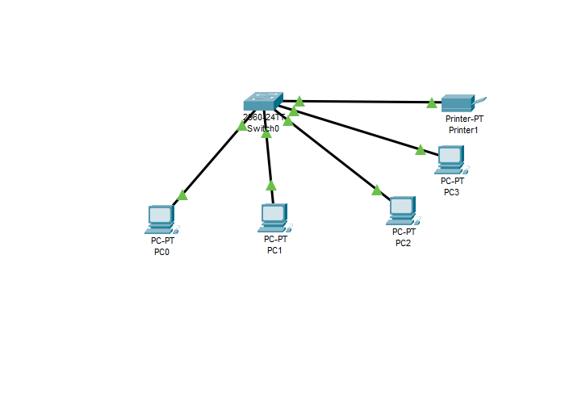

# Exercício I
## Sobre o projeto:
Esse projeto tem como objetivo simular um ambiente onde switch foi utilizado para conectar uma rede local. 
## Exercício utilizado para a criação do projeto:
+ Switch 2960.
+ Configure o host PC0 com o IP 192.168.0.1, máscara 255.255.255.0. 
+ Configure o host PC1 com o IP 192.168.0.2, máscara 255.255.255.0. 
+ Configure o host PC2 com o IP 192.168.0.3, máscara 255.255.255.0. 
+ Adicione um novo computador PC2 a rede e especificar um IP.
+ Adicione uma impressora PRINTER-PT com o IP 192.168.0.4 e máscara 255.255.255.0 a rede. 

## Tecnologias utilizadas:
O projeto utiliza o Cisco Packet Tracer. 

## Principais funcionalidades:
Simular um ambiente onde um switch seria utilizado para a rede local. \
!

